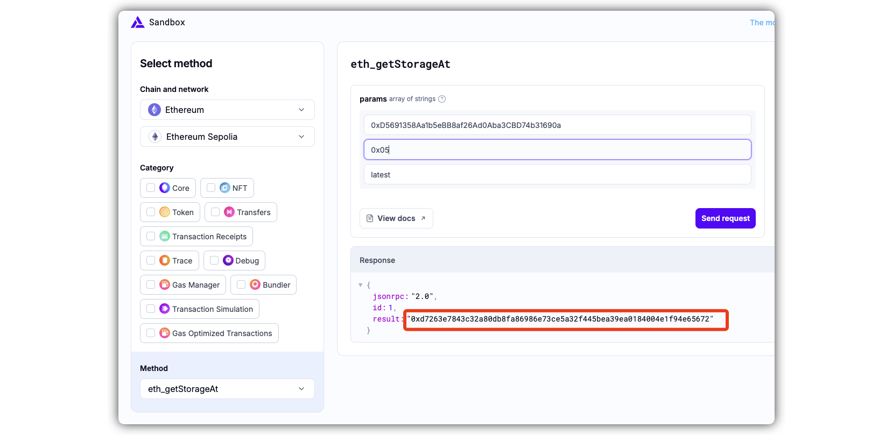

# level 12: Privacy

## 1. 问题

要求你解锁合约 `Privacy`, 也就是成功调用合约的 `unlock` 函数，将 `locked` 设置为 false。

```solidity
// SPDX-License-Identifier: MIT
pragma solidity ^0.8.0;

contract Privacy {
    bool public locked = true;
    uint256 public ID = block.timestamp;
    uint8 private flattening = 10;
    uint8 private denomination = 255;
    uint16 private awkwardness = uint16(block.timestamp);
    bytes32[3] private data;

    constructor(bytes32[3] memory _data) {
        data = _data;
    }

    function unlock(bytes16 _key) public {
        require(_key == bytes16(data[2]));
        locked = false;
    }

    /*
    A bunch of super advanced solidity algorithms...

      ,*'^`*.,*'^`*.,*'^`*.,*'^`*.,*'^`*.,*'^`
      .,*'^`*.,*'^`*.,*'^`*.,*'^`*.,*'^`*.,*'^`*.,
      *.,*'^`*.,*'^`*.,*'^`*.,*'^`*.,*'^`*.,*'^`*.,*'^         ,---/V\
      `*.,*'^`*.,*'^`*.,*'^`*.,*'^`*.,*'^`*.,*'^`*.,*'^`*.    ~|__(o.o)
      ^`*.,*'^`*.,*'^`*.,*'^`*.,*'^`*.,*'^`*.,*'^`*.,*'^`*.,*'  UU  UU
    */
}
```


## 2. 解法

这题考察的是你对合约 storage 的了解情况。

> [!TIP]
> 关于合约storage的介绍，可以看下下面的文章:
> 1. [详解Solidity合约数据存储布局](https://learnblockchain.cn/books/geth/part7/storage.html)
> 
> 进一步关于合约存储(storage、memory、calldata)，可以看下下面的文章：
> 1. [深入Solidity数据存储位置](https://learnblockchain.cn/article/4864)

1. 定长数据在 `storage` 中都是 **固定的、紧凑存储的、从右往左的**:

|数据类型|占storage的长度|
|---|---|
|bool|1 Byte|
|uint8|1 Byte|
|uint16|2 Byte|
|address|20 Byte|
|enum|1 Byte|
|bytes1|1 Byte|
|bytes2|2 Byte|
|uint8[10]|10 Byte|


2. 我们针对本题的数据，进行分析。 `Privacy` 合约中的所有 `storage` 变量，都是定长数据。所以我们可以画出storage的示意图, 并且知道我们要找的 `data[2]` 的值就在 `slot 5`：


3. 我们使用 alchemy 提供的 [storage 查询工具](https://sandbox.alchemy.com/?network=ETH_SEPOLIA&method=eth_getStorageAt&body.id=1&body.jsonrpc=2.0&body.method=eth_getStorageAt&body.params%5B0%5D=0xD5691358Aa1b5eBB8af26Ad0Aba3CBD74b31690a&body.params%5B1%5D=0x05&body.params%5B2%5D=latest) 查看 `Privacy` 合约的 `slot 5` 中的值为 `0xd7263e7843c32a80db8fa86986e73ce5a32f445bea39ea0184004e1f94e65672`：



4. 我们在remix中对合约进行编译，然后通过 `At Address` 绑定合约地址 `0xD5691358Aa1b5eBB8af26Ad0Aba3CBD74b31690a`

5. `unlock` 函数传入的值，是 `bytes16(data[2])` 的结果，是取高位的16字节，为 `0xd7263e7843c32a80db8fa86986e73ce5`

> [!TIP]
> 这里我们可以通过 `chisel` 来验证我们的说法：
> 

5. 在remix中调用 `unlock` 函数，输入 `0xd7263e7843c32a80db8fa86986e73ce5` , [交易链接](https://sepolia.etherscan.io/tx/0xff32d4cc9e5aa145914647dd9ff8b1658b4d0d84e130a9e8e70d859b89d93b1b)

6. 在ethernaut网页上点击 `submit instance`，通过！

| [⬅️ level11 Elevator](../level11_elevator/README.md) | [level13 ➡️](../level12_privacy/README.md) |
|:------------------------------|--------------------------:|