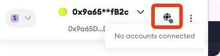

# level 15: Naught Coin

## 1. 问题

你在一个 `ERC-20` 合约部署的时候被出事授予了一大堆钱，但是这个 `ERC-20` 合约的 `transfer` 接口做了限制，只有在 10 年后，才允许你调用 `transfer` 接口，对于其他用户没有这个校验/要求。

现在请你把这个 token 里面在你名下的所有资产转移给其他人，从而达到可以正常使用的效果。

合约如下：

```solidity
// SPDX-License-Identifier: MIT
pragma solidity ^0.8.0;

import "openzeppelin-contracts-08/token/ERC20/ERC20.sol";

contract NaughtCoin is ERC20 {
    // string public constant name = 'NaughtCoin';
    // string public constant symbol = '0x0';
    // uint public constant decimals = 18;
    uint256 public timeLock = block.timestamp + 10 * 365 days;
    uint256 public INITIAL_SUPPLY;
    address public player;

    constructor(address _player) ERC20("NaughtCoin", "0x0") {
        player = _player;
        INITIAL_SUPPLY = 1000000 * (10 ** uint256(decimals()));
        // _totalSupply = INITIAL_SUPPLY;
        // _balances[player] = INITIAL_SUPPLY;
        _mint(player, INITIAL_SUPPLY);
        emit Transfer(address(0), player, INITIAL_SUPPLY);
    }

    function transfer(address _to, uint256 _value) public override lockTokens returns (bool) {
        super.transfer(_to, _value);
    }

    // Prevent the initial owner from transferring tokens until the timelock has passed
    modifier lockTokens() {
        if (msg.sender == player) {
            require(block.timestamp > timeLock);
            _;
        } else {
            _;
        }
    }
}
```


## 2. 解法

虽然不能直接通过 `transfer` 直接转出，但是我们可以通过 `approve + transferFrom` 的形式搞定。

1. 在 remix 上编译这个代码，并选择 `At Address` 绑定部署的实例

```solidity
// SPDX-License-Identifier: MIT
pragma solidity ^0.8.0;

interface INaughtCoin {

    function approve(address spender, uint256 value) external returns (bool);
    
    function transferFrom(address from, address to, uint256 value) external returns (bool);

    function balanceOf(address account) external view returns (uint256);
}
```

2. 调用 `balanceOf` 接口，查询余额为 `1000000000000000000000000`


3. 调用 `approve` 接口，给另外一个自己的EOA地址转出资产，交易地址 [0x74b9282fde39166645a552e0001b9ea8b4a7ee7f939508b669c2bd34d055b400](https://sepolia.etherscan.io/tx/0x74b9282fde39166645a552e0001b9ea8b4a7ee7f939508b669c2bd34d055b400)


4. 切换成第二个EOA地址，调用 `transferFrom`，将资产转到自己名下, 交易地址 [0xf2aeac89c440ce2959aff3ffaf80722225b5734599b77be7032425ac7c1e4954](https://sepolia.etherscan.io/tx/0xf2aeac89c440ce2959aff3ffaf80722225b5734599b77be7032425ac7c1e4954)：


> [!TIP]
> 在remix中，如果要切换 metamask 的账号，需要在 metamask 里面的老账号右上角点击 `disconnect`
> 


5. 点击 `submit instance`， 提交通过！


<br/>
<br/>
| [⬅️ level14 GatekeeperTwo](../level14_gatekeeper_two/README.md) | [level16 Preservation ➡️](../level16_preservation/README.md) |
|:------------------------------|--------------------------:|
