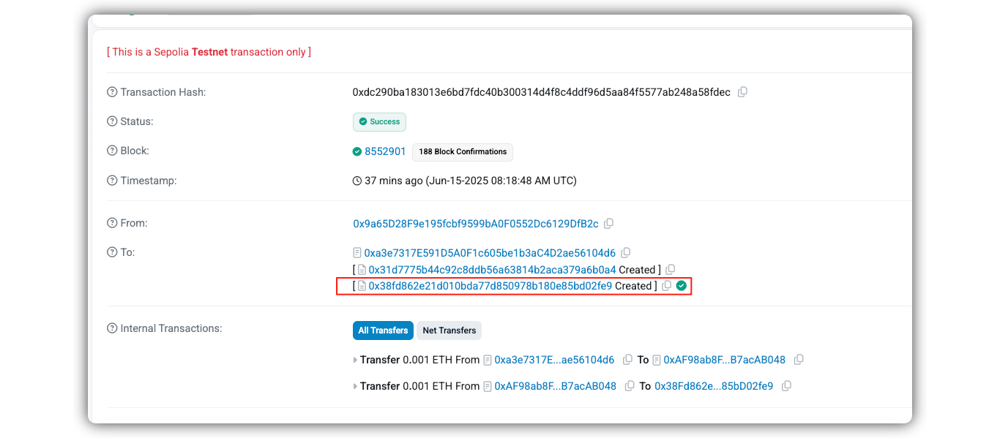
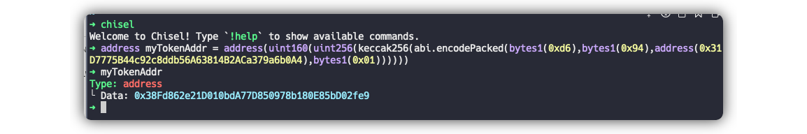

# Level 17: Recovery

## 1. 问题

你通过一个一个叫 `Recovery` 的工厂合约创建了一个 `SimpleToken` 的 ERC-20 合约，并且向这个 ERC-20 合约中转入了 `0.001 ether`。现在你只能看到 工厂合约 的地址，没办法直接看到 ERC-20 合约的地址。

现在要求我们把 ERC-20 合约中的 `0.001 ether` 转出。

```solidity
// SPDX-License-Identifier: MIT
pragma solidity ^0.8.0;

contract Recovery {
    //generate tokens
    function generateToken(string memory _name, uint256 _initialSupply) public {
        new SimpleToken(_name, msg.sender, _initialSupply);
    }
}

contract SimpleToken {
    string public name;
    mapping(address => uint256) public balances;

    // constructor
    constructor(string memory _name, address _creator, uint256 _initialSupply) {
        name = _name;
        balances[_creator] = _initialSupply;
    }

    // collect ether in return for tokens
    receive() external payable {
        balances[msg.sender] = msg.value * 10;
    }

    // allow transfers of tokens
    function transfer(address _to, uint256 _amount) public {
        require(balances[msg.sender] >= _amount);
        balances[msg.sender] = balances[msg.sender] - _amount;
        balances[_to] = _amount;
    }

    // clean up after ourselves
    function destroy(address payable _to) public {
        selfdestruct(_to);
    }
}
```

## 2. 解法

我们通过看 `SimpleToken` 合约的源码可以发现，任何人都可以调用这个合约的 `destroy` 接口销毁合约，同样也能返还拿到 `0.001 ether`，所以我们只要知道这个 token合约的地址即可。


## 2.1. 解法1：通过区块链浏览器

1. 我们通过 ethernaut的 浏览器控制台，查询到 `instance address` 为 [0x31D7775B44c92c8ddb56A63814B2ACa379a6b0A4](https://sepolia.etherscan.io/address/0x31D7775B44c92c8ddb56A63814B2ACa379a6b0A4#internaltx), 这个就是 `Recovery` 合约的地址

2. 我们通过在区块链浏览器，查询 `Recovery` 合约的[部署交易](https://sepolia.etherscan.io/tx/0xdc290ba183013e6bd7fdc40b300314d4f8c4ddf96d5aa84f5577ab248a58fdec)，可以看到 `SimpleToken` 合约的地址[0x38fd862e21d010bda77d850978b180e85bd02fe9](https://sepolia.etherscan.io/address/0x38fd862e21d010bda77d850978b180e85bd02fe9)：



3. 在remix中直接编译interface:

```solidity
// SPDX-License-Identifier: MIT
pragma solidity ^0.8.0;

interface SimpleTokenInterface {
    function destroy(address payable _to) external;
}
```

4.  然后通过interface调用这个合约的destroy接口, 即可转出 ether: [0x9692d1aa466dad0c3e82fd7f8bd53965bf23f3cc83ebe92cb9211adbed00dfe9](https://sepolia.etherscan.io/tx/0x9692d1aa466dad0c3e82fd7f8bd53965bf23f3cc83ebe92cb9211adbed00dfe9)

5. 点击 `submit instance`， 提交通过！

## 2.2 解法2：根据 `Recovery` 合约地址自助算出 `SimpleToken` 合约地址

1. `Recovery` 合约通过 `new SimpleToken(...)` 创建 token合约，背后是通过EVM的 `CREATE` 操作码实现的，而 `CREATE` 操作码部署合约时的地址有明确的生成规则。

> [!NOTE]
> 合约A调用 `CREATE` 操作码部署的合约X，其地址为 `uint160(uint256(keccak256(abi.encodePacked(bytes1(0xd6), bytes1(0x94), address(RecoveryContract), bytes1(0x01)))))`
> 1. `bytes1(0xd6)=0xc0(表示列表)+ len(paylod), len(payload)=1byte前缀+20bytes地址+1byte nonce` 是RLP编码中 `长度为2的列表，后面跟2个元素`的表述
> 2. `bytes1(0x94)=0x80 + len(data) = 0x80 + 0x14` 是RLP编码中 `一个长度为 20(0x14)字节 字符串` 的表示，对应后续的地址
> 3. 最后一个参数 `bytes1(0x01)`， 对应 nonce，代表这个合约A通过 `CREATE` 操作码创建的第几个新合约。我们是刚部署 `Recovery` 合约后创建的第一个 token合约，所以这里 nonce 为 1

2. 我们可以通过 `chisel` 工具本地计算出 `SimpleToken` 合约地址：



3. 剩下流程合约 `解法1` 一样


<br/>
<br/>

| [⬅️ level16 Preservation](../level16_preservation/README.md) | [level18 MagicNumber ➡️](../level18_magicnumber/README.md) |
|:------------------------------|--------------------------:|
