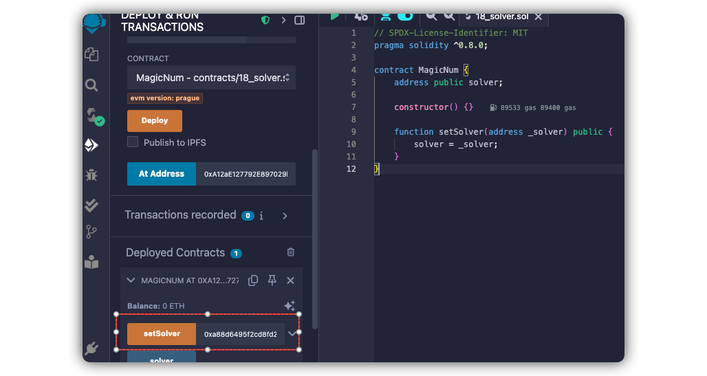

# Level 18: Magic Number

## 1. 问题

要求我们写一个 `Solver` 合约，合约里包括 `whatIsTheMeaningOfLife()` 这个接口，但是合约大小不超过 `10 bytes`。

```solidity
// SPDX-License-Identifier: MIT
pragma solidity ^0.8.0;
contract MagicNum {
    address public solver;

    constructor() {}

    function setSolver(address _solver) public {
        solver = _solver;
    }
}
```

## 2. 解法

1. 我们随便写一个正常的合约，编译看下他的大小

```solidity
// SPDX-License-Identifier: MIT
pragma solidity ^0.8.0;

contract Solver {
    function whatIsTheMeaningOfLife() external pure returns (uint256) {
        return 0;
    }
}
```

2. `forge inspect Solver deployedBytecode`，得到上面的合约编译出来的字节码（存储在链上的）有110+字节，远超要求！

> [!NOTE]
> 通过编译 solidity 合约得到的字节码，开头包含了 `[dispatcher](https://learnblockchain.cn/article/5445#%E4%BB%A3%E7%A0%81%E7%9A%84%E5%B8%83%E5%B1%80)` 的调度逻辑， 中间包含了合约每个接口的真实逻辑，最后还会有 `fallback` 的默认处理逻辑，所o会很大


3. 真实的字节分布大概如下：
```
[ dispatcher (~30B) ]
  - PUSH4 selector
  - EQ + JUMPI
  - fallback fallback fallback
[ JUMPDEST (~2B) ]
[ function body (~10B) ]
  - return 43
[ fallback/INVALID (~10-20B) ]

```

3. 我们通过手工操作字节码，得到精简的逻辑：

|EVM字节码|EVM汇编语言|解释|
|--|--|--|
|602B|PUSb1 0x2b | 将 待返回的目标值 `0x2b(43)` 压入栈顶|
|6000|PUSH1 0x00 | 将 内存地址offset `0x00` 压入栈顶|
|52|MSTORE | 依次从栈顶弹出2个值s1(`0x00`)，s2(`0x2b`)，将s2写入以s1为起点的内存，长度为固定的32字节|
|6020|PUSH1 0x20 | 将 `0x20` 压栈|
|6000|PUSH1 0x00 | 将 `0x00` 压栈|
|F3|RETURN | 依次从栈顶弹出2个值s1(`0x00`)，s2(`0x20`)，将内存空间中从[s1, s2]的值返回给调用者|

4. 上面得到的字节码为 `0x602B60005260206000F3`, 正好10字节

5. 我们继续构造一个可以用于部署的字节码（带constructor）：

|EVM字节码|EVM汇编语言|解释|
|--|--|--|
|69602B60005260206000F3|PUSH10 0x602B60005260206000F3|将合约函数逻辑压栈|
|6000|PUSH1 0x00|将 内存地址offset `0x00` 压入栈顶，用于等下返回合约函数逻辑|
|52|MSTORE|同上，将栈里的合约逻辑读到内存中，占32字节。因为栈里面只有10字节，所以后面都是空的|
|600A|PUSH1 0x0A|代表等会儿要返回函数逻辑对应的10个字节数据|
|6016|PUSH1 0x16|代表等会儿返回的内存数据是 memory[0x16, 0x16+0x0A],对应刚刚放到内存中的函数逻辑|

6. 上面得到部署用的字节码 `0x69602B60005260206000F3600052600A6016`

7. 我们通过remix的控制台，执行下面脚本来部署合约（会唤起metamask客户端进行签名）, 部署得到合约地址 [0xc2ce5cc7a7e98f67e4d926c52e5149f47d20dd1a](https://sepolia.etherscan.io/address/0xc2ce5cc7a7e98f67e4d926c52e5149f47d20dd1a)

```javascript
web3.eth.sendTransaction({
  from: "0x9a65D28F9e195fcbf9599bA0F0552Dc6129DfB2c",
  data: "0x69602b60005260206000f3600052600a6016f3",
  gas: 100000
}).then(console.log);
```

8. 在 remix 中编译 `MagicNum` 合约并制定部署好的合约地址，然后调用 `setSolver` 来绑定我们刚刚部署好的合约, 交易地址 [0x67feb92b7350231cac56e7e1a3821625422d11de7e84915e13645624b7a5889c](https://sepolia.etherscan.io/tx/0x67feb92b7350231cac56e7e1a3821625422d11de7e84915e13645624b7a5889c)：



9. 点击 `submit instance`，提交通过！

<br/>
<br/>

| [⬅️ level17 Recovery](../level17_recovery/README.md) | [level19 Allen Codex ➡️](../level19_allencodex/README.md) |
|:------------------------------|--------------------------:|
