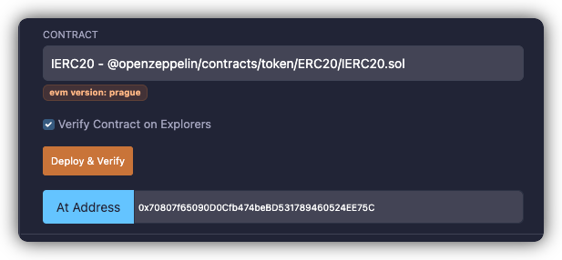
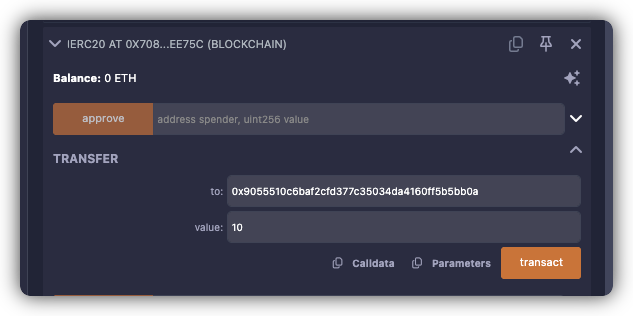

# Level 22: Dex

## 1. 问题
要求你把 `Dex` 合约中 `token1`, 或者 `token2` 的余额清0（全部取出），使得他后续无法继续提供双向的兑换服务

<details>
<summary>点击展开原始问题说明</summary>

The goal of this level is for you to hack the basic `DEX` contract below and steal the funds by price manipulation.

You will start with 10 tokens of `token1` and 10 of `token2`. The DEX contract starts with 100 of each token.

You will be successful in this level if you manage to drain all of at least 1 of the 2 tokens from the contract, and allow the contract to report a "bad" price of the assets.

> Quick note
Normally, when you make a swap with an ERC20 token, you have to `approve` the contract to spend your tokens for you. To keep with the syntax of the game, we've just added the `approve` method to the contract itself. So feel free to use `contract.approve(contract.address, <uint amount>)` instead of calling the tokens directly, and it will automatically approve spending the two tokens by the desired amount. Feel free to ignore the `SwappableToken` contract otherwise.

Things that might help:

* How is the price of the token calculated?
* How does the `swap` method work?
* How do you `approve` a transaction of an ERC20?
* Theres more than one way to interact with a contract!
* Remix might help
* What does "At Address" do?

```solidity
// SPDX-License-Identifier: MIT
pragma solidity ^0.8.0;

import "openzeppelin-contracts-08/token/ERC20/IERC20.sol";
import "openzeppelin-contracts-08/token/ERC20/ERC20.sol";
import "openzeppelin-contracts-08/access/Ownable.sol";

contract Dex is Ownable {
    address public token1;
    address public token2;

    constructor() {}

    function setTokens(address _token1, address _token2) public onlyOwner {
        token1 = _token1;
        token2 = _token2;
    }

    function addLiquidity(address token_address, uint256 amount) public onlyOwner {
        IERC20(token_address).transferFrom(msg.sender, address(this), amount);
    }

    function swap(address from, address to, uint256 amount) public {
        require((from == token1 && to == token2) || (from == token2 && to == token1), "Invalid tokens");
        require(IERC20(from).balanceOf(msg.sender) >= amount, "Not enough to swap");
        uint256 swapAmount = getSwapPrice(from, to, amount);
        IERC20(from).transferFrom(msg.sender, address(this), amount);
        IERC20(to).approve(address(this), swapAmount);
        IERC20(to).transferFrom(address(this), msg.sender, swapAmount);
    }

    function getSwapPrice(address from, address to, uint256 amount) public view returns (uint256) {
        return ((amount * IERC20(to).balanceOf(address(this))) / IERC20(from).balanceOf(address(this)));
    }

    function approve(address spender, uint256 amount) public {
        SwappableToken(token1).approve(msg.sender, spender, amount);
        SwappableToken(token2).approve(msg.sender, spender, amount);
    }

    function balanceOf(address token, address account) public view returns (uint256) {
        return IERC20(token).balanceOf(account);
    }
}

contract SwappableToken is ERC20 {
    address private _dex;

    constructor(address dexInstance, string memory name, string memory symbol, uint256 initialSupply)
        ERC20(name, symbol)
    {
        _mint(msg.sender, initialSupply);
        _dex = dexInstance;
    }

    function approve(address owner, address spender, uint256 amount) public {
        require(owner != _dex, "InvalidApprover");
        super._approve(owner, spender, amount);
    }
}
```

</details>

## 2. 解题思路

`Dex.getSwapPrice` 按照他持有的 2 个 token 比例来算的，在 `Dex` 内部占比越小，`Dex` 认为他价值越高，越值钱。

所以我们利用他这个错误的期望，每次都拿池子中占比数量小的 token，换池子中占比数量大的 token，最终就能换得比理论值更多的目标 token。并且通过多次操作，最终换空其中一种。

## 3. 执行步骤


1. [部署 `DexHack` 合约](https://sepolia.etherscan.io/tx/0xc9937f79b4c1672786befc6ccde93f82f8a6a57dd23d4cc603b488ab4f9c9076)
2. 将 `EOA` 持有的资产转移给 `DexHack` 操作
  - [token1资产转移给 `DexHack`](https://sepolia.etherscan.io/tx/0x6dac403a60ef339caeed57a852223ac360a019362fbd17428f0e5db5e95447b9)
  - [token2资产转移给 `DexHack`](https://sepolia.etherscan.io/tx/0xc229decf41e9a6613004c59a816bd2cb9b51c322e077eee92fd5f0b9b85f9aff)

> [!TIP]
> 通过 `At Address` 方法，在 `remix` 中创建 `token1`, `token2` 的交互
>
> 
> 

3. [调用 `DexHack.loopCall()`](https://sepolia.etherscan.io/tx/0x5ce491d4614304f9bb8f7be96ef248734e47649a5769f46d819232c2979ceb84) 直到 `Dex` 内的资产枯竭
4. [Submit instance](https://sepolia.etherscan.io/tx/0x0b2469b2c90473c999aef130f7927abb0e3cb144e1c599cb5a94148d664fe4ff), 通过！

## 4. 本地联调测试

> [!NOTE]
> 这里我们提供一个测试文件 [Level22.t.sol](../../test/level22/Level22_localTest.t.sol)
> 可以在提交之前进行本地调试，调试成功再在测试链上执行

<br/>
<br/>

| [⬅️ level21 Shop](../level21_shop/README.md) | [level23 Dex Two ➡️](../level23_dex_two/README.md) |
| :----------------------------------------------- | ------------------------------------------: |