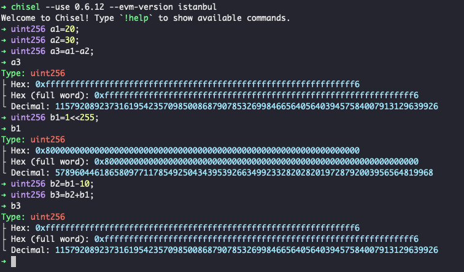

# level5 token

## 1. 问题
要求修改这个`Token`合约，将这个合约中你的地址对应的余额增加。

```solidity
// SPDX-License-Identifier: MIT
pragma solidity ^0.6.0;

contract Token {
    mapping(address => uint256) balances;
    uint256 public totalSupply;

    constructor(uint256 _initialSupply) public {
        balances[msg.sender] = totalSupply = _initialSupply;
    }

    function transfer(address _to, uint256 _value) public returns (bool) {
        require(balances[msg.sender] - _value >= 0);
        balances[msg.sender] -= _value;
        balances[_to] += _value;
        return true;
    }

    function balanceOf(address _owner) public view returns (uint256 balance) {
        return balances[_owner];
    }
}
```

## 2. 解法
虽然这个合约总的发行量比较大，但是别的用户都是我们掌控不了的，不能让别的持有余额的地址给我们转token，所以我们只能使用其漏洞修改自己的余额。

在solidity的`0.8.0`之前，uint是没有越界的概念的，比如`uint256(2)-uint256(4)=uint256(2^256-2)`，evm运行时不会报错。我们就要利用这个漏洞！

1. 使用chrome控制台调用下合约，看下总发行量（对解决问题没有直接帮助）,确认有`21000000`
```bash
await contract.totalSupply().then(v=>v.toString());
```

2. 直接将合约源码[token.sol](./token.sol)在remix中编译，记得选择remix编译版本为`0.6.x`

3. 在remix中发起transfer调用，填入30（基本上，任何一个比20大的数都可以）即可, 目标地址随便填，我填了`0x136471a34f6ef19fE571EFFC1CA711fdb8E49f2b`, 交易地址[905e1ad16ea8dc15ce3009df9ce76060e547695a132aa3508e64f1cf378126f](https://sepolia.etherscan.io/tx/0x3905e1ad16ea8dc15ce3009df9ce76060e547695a132aa3508e64f1cf378126f)

4. 调用remix的balanceOf，查询自己的余额，发现已经变得很大了。或者我们也可以用chrome控制台查看余额, 发现已经变成一个很大的值了
```bash
await contract.balanceOf("0x.....").then(v=>v.toString());
```

5. 点击 `submit instance`， 提交通过！

## 3. 补充说明

实际上，我们看到的新余额，就是 20-30，也就是 (2^256)-10, 我们可以用chisel模拟一下：

1. 使用0.6.12版本启动chisel：
```bash
chisel --use 0.6.12 --evm-version istanbul
```

2. 执行下下面的语句，最后打印一下a3，发现其值和我们在链上查到的一致：
```solidity
uint256 a1=20;
uint256 a2=30;
uint256 a3=a1-a2;
a3

uint256 b1=1<<255;
uint256 b2=b1-10;
uint256 b3=b2+b1;
b3
```

