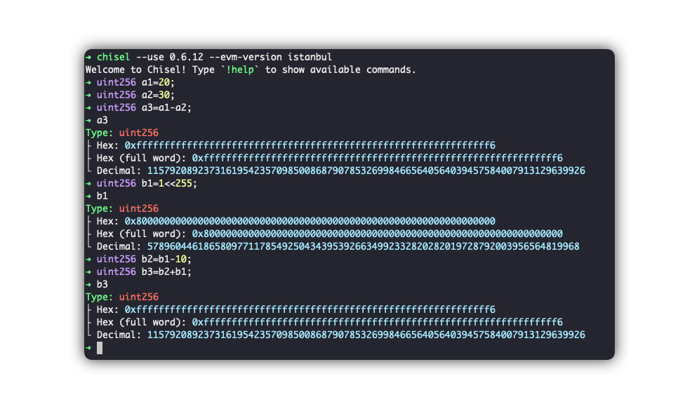

# level5 Token

## 1. 问题

要求修改 `Token` 合约，将你的地址对应的余额增加。


```solidity
// SPDX-License-Identifier: MIT
pragma solidity ^0.6.0;

contract Token {
    mapping(address => uint256) balances;
    uint256 public totalSupply;

    constructor(uint256 _initialSupply) public {
        balances[msg.sender] = totalSupply = _initialSupply;
    }

    function transfer(address _to, uint256 _value) public returns (bool) {
        require(balances[msg.sender] - _value >= 0);
        balances[msg.sender] -= _value;
        balances[_to] += _value;
        return true;
    }

    function balanceOf(address _owner) public view returns (uint256 balance) {
        return balances[_owner];
    }
}
```

## 2. 解法

虽然这个合约的总发行量较大，但其他用户的余额不受我们控制，无法通过他们转账的方式增加自己的余额。因此，我们需要利用合约中的漏洞直接修改自己的余额。

> [!NOTE]
> 在 Solidity `0.8.0` 之前，`uint` 类型是没有越界检查的。例如，`uint256(2) - uint256(4)` 会得到 `uint256(2^256 - 2)`，而 EVM 运行时不会报错。我们需要利用这个漏洞来实现目标！


1. 使用 Chrome 控制台调用合约，查询总发行量（对解决问题没有直接帮助），确认为 `21000000`：
```bash
await contract.totalSupply().then(v => v.toString());

```bash
await contract.totalSupply().then(v=>v.toString());
```

2. 直接将合约源码[token.sol](./token.sol)在remix中编译。

> [!TIP]
> 记得选择remix编译版本为`0.6.x`

6. 在 Remix 中发起 `transfer` 调用，填入 `30`（基本上，任何一个大于 `20` 的数都可以），目标地址随意填写。我使用了 `0x136471a34f6ef19fE571EFFC1CA711fdb8E49f2b`，交易地址为 [链接](https://sepolia.etherscan.io/tx/0x3905e1ad16ea8dc15ce3009df9ce76060e547695a132aa3508e64f1cf378126f)。


7. 调用 Remix 的 `balanceOf` 方法查询自己的余额，发现余额已变得非常大。或者，也可以通过 Chrome 控制台查询余额，确认为一个非常大的值：

```bash
await contract.balanceOf("0x.....").then(v=>v.toString());
```

1. 点击 `submit instance`， 提交通过！

## 3. 补充说明

实际上，我们看到的新余额是 `20 - 30`，即 `(2^256) - 10`。我们可以使用 `chisel` 工具进行模拟：

> [!TIP]
> 要使用`chisel`, 需要先安装foundry，安装完成后即可使用

1. 使用0.6.12版本启动chisel：
```bash
chisel --use 0.6.12 --evm-version istanbul
```

2. 执行下下面的语句，最后打印一下a3，发现其值和我们在链上查到的一致：
```solidity
uint256 a1=20;
uint256 a2=30;
uint256 a3=a1-a2;
a3

uint256 b1=1<<255;
uint256 b2=b1-10;
uint256 b3=b2+b1;
b3
```



| [⬅️ level4 Telephone](../level4_telephone/README.md) | [level6 Delegation ➡️](../level6_delegation/README.md) |
|:------------------------------|--------------------------:|