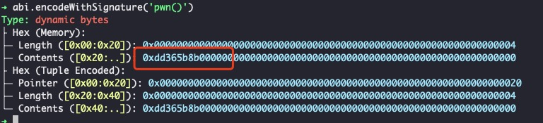
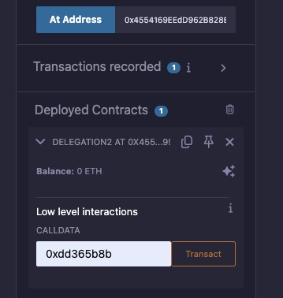

# level6 delegation

## 1. 问题
将`Delegation`合约的owner修改为自己的账户地址。

```solidity
// SPDX-License-Identifier: MIT
pragma solidity ^0.8.0;

contract Delegate {
    address public owner;

    constructor(address _owner) {
        owner = _owner;
    }

    function pwn() public {
        owner = msg.sender;
    }
}

contract Delegation {
    address public owner;
    Delegate delegate;

    constructor(address _delegateAddress) {
        delegate = Delegate(_delegateAddress);
        owner = msg.sender;
    }

    fallback() external {
        (bool result,) = address(delegate).delegatecall(msg.data);
        if (result) {
            this;
        }
    }
}
```

## 2. 解法
本题初始部署了2个合约`Delegation`和`Delegate`, 前者记录了后者地址，并在fallback函数里面通过delegatecall调用了`delegate`合约。

`Delegate`这个合约中pwn这个函数，就是把合约中第一个slot的address值设置为msg.sender，而`Delegation`合约的第一个slot参数也是address，恰好就是我们想改的owner！

我们就是要触发这个fallback合约执行，因为`Delegate`合约恰好有个叫pwn的函数，可以设置owner地址为消息的发送方。

### 2.1 解法1：直接在Delegation中“创建一个pwn函数”
1. 通过观察`Delegation`的fallback我们发现，他其实就是相当于将`Delegate`作为他的逻辑合约，`Delegation`实际上是代理合约。

2. 所以，我们可以在remix中，重新定义`Delegation`的方法，加一下`pwn`这个函数，如下所示：

```solidity
// SPDX-License-Identifier: MIT
pragma solidity ^0.8.0;

interface Delegation {

    // 直接调用pwn函数，实际上Delegation合约会通过delegatecall调用Delegate的pwn来执行
    function pwn() external;

    // 查询owner，方便remix校验结果
    function owner() external view returns (address);
}
```

3. 在remix中编译，并指定`at address`关联到已有的合约地址，地址填`Delegation`的地址

4. 我们先点击remix里面的`owner`函数，查一下现在的地址，发现是`0x73379d8B82Fda494ee59555f333DF7D44483fD58`   

5. 在remix中，直接点击pwn, 提交交易[0x8e56037b4868f25f6b7ad603b025ad3c209e582e33641a5c3b6836014111aa1a](https://sepolia.etherscan.io/tx/0x8e56037b4868f25f6b7ad603b025ad3c209e582e33641a5c3b6836014111aa1a)


4. 我们再点击remix里面的`owner`函数，查一下现在的地址，发现已经改好了!

5. 点击 `submit instance`， 提交通过！

### 2.2 解法2：手工构造delegatecall的参数

1. 假如我们没有发现`Delegation`和`Delegate`函数是proxy合约 vs 逻辑合约的关系，也没事，我们就按照fallback函数的逻辑，手工构造出来`msg.data`, 使得正好可以调用pwn的逻辑。

2. 为此，我们通过delegatecall应该构造的参数应该是`address(DelegateAddress).delegatecall(abi.encodeWithSignature('pwn()'));`. 问题就转换成，如何算出来`abi.encodeWithSignature('pwn()')`的值

3. 我们启动chisel（需要安装foundry），执行下面的命令：
```solidity
abi.encodeWithSignature('pwn()')
```



- 因为函数的签名是取前4个字节，所以我们要填的值是`0xdd365b8b`

4. 正式开始编译remix，准备调用，我们对下面的代码进行编译：
```solidity
// SPDX-License-Identifier: MIT
pragma solidity ^0.8.0;

interface Delegation2 {

    // 如果不写这个函数，remix不允许我们调用transact按钮
    fallback() external;
}
```

> 因为刚刚我们已经展示了owner函数，对于解法2 ，我们就不加了，需要的也可以加一下owner函数，自己按体验一下。

5. 同样选择`at address`, 输入合约地址

6. 我们直接通过remix里面的transact方式，发起交易[0xe35f7832c401ef753f066fa8242dc1c5459e66154d7f32111f028c37fced5909](https://sepolia.etherscan.io/tx/0xe35f7832c401ef753f066fa8242dc1c5459e66154d7f32111f028c37fced5909)



7. 这次我们在chrome的控制台，用ethernaut提供的合约交互接口查一下owner，发现已经变成我们自己的账户了：
```bash
await contract.owner();
```

8. 点击 `submit instance`， 提交通过！


## 3. 补充说明

1. 我们使用transact方法调用时，原理上他会先便利`Delegation`的所有function，看下有没有某个函数的selector恰好是`0xdd365b8b`, 如果没有，则会调用`Delegation`的fallback方法，达到我们的效果。 关于fallback和receive的用法，可以阅读一下这篇文章 [Solidity中的回退函数fallback和receive详解](https://learnblockchain.cn/article/8435)