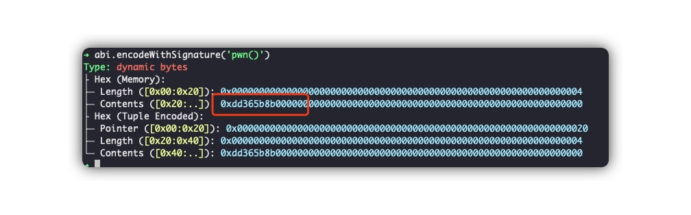

# level6 Delegation

## 1. 问题

将 `Delegation` 合约的 `owner` 修改为自己的账户地址。

```solidity
// SPDX-License-Identifier: MIT
pragma solidity ^0.8.0;

contract Delegate {
    address public owner;

    constructor(address _owner) {
        owner = _owner;
    }

    function pwn() public {
        owner = msg.sender;
    }
}

contract Delegation {
    address public owner;
    Delegate delegate;

    constructor(address _delegateAddress) {
        delegate = Delegate(_delegateAddress);
        owner = msg.sender;
    }

    fallback() external {
        (bool result,) = address(delegate).delegatecall(msg.data);
        if (result) {
            this;
        }
    }
}
```

## 2. 解法

本题中初始部署了两个合约：`Delegation` 和 `Delegate`。前者记录了后者的地址，并在 `fallback` 函数中通过 `delegatecall` 调用了 `Delegate` 合约。

`Delegate` 合约中的 `pwn` 函数会将合约中第一个存储槽（slot）中的地址值设置为 `msg.sender`。而 `Delegation` 合约的第一个存储槽也是地址类型（address），恰好对应我们想修改的 `owner`！

我们就是要触发这个fallback合约执行，因为`Delegate`合约恰好有个叫`pwn`的函数，可以设置owner地址为消息的发送方。

### 2.1 解法1：直接在Delegation中“创建一个pwn函数”
1. 通过观察`Delegation`的fallback我们发现，他其实就是相当于将`Delegate`作为他的逻辑合约，`Delegation`实际上是代理合约。

2. 所以，我们可以在remix中，重新定义`Delegation`的方法，加一下`pwn`这个函数，如下所示：

```solidity
// SPDX-License-Identifier: MIT
pragma solidity ^0.8.0;

interface Delegation {

    // 直接调用pwn函数，实际上Delegation合约会通过delegatecall调用Delegate的pwn来执行
    function pwn() external;

    // 查询owner，方便remix校验结果
    function owner() external view returns (address);
}
```

3. 在 Remix 中编译，并选择 `at address`，关联到已有的合约地址，输入 `Delegation` 合约的地址。

4. 我们先点击remix里面的`owner`函数，查一下现在的地址，发现是`0x73379d8B82Fda494ee59555f333DF7D44483fD58`   

5. 在 Remix 中直接点击 `pwn`，提交交易：[交易链接](https://sepolia.etherscan.io/tx/0x8e56037b4868f25f6b7ad603b025ad3c209e582e33641a5c3b6836014111aa1a)。

4. 我们再点击remix里面的`owner`函数，查一下现在的地址，发现已经改好了!

5. 点击 `submit instance`， 提交通过！

### 2.2 解法2：手工构造delegatecall的参数

1. 假如我们没有发现`Delegation`和`Delegate`函数是proxy合约 vs 逻辑合约的关系，也没事，我们就按照fallback函数的逻辑，手工构造出来`msg.data`, 使得正好可以调用pwn的逻辑。

2. 为此，我们通过delegatecall应该构造的参数应该是:
```solidity
address(DelegateAddress).delegatecall(abi.encodeWithSignature('pwn()'));
```

3. 问题就转换成，如何算出来`abi.encodeWithSignature('pwn()')`的值

4. 我们启动chisel（需要安装foundry），执行下面的命令：
```solidity
abi.encodeWithSignature('pwn()')
```



5. 因为函数的签名是取前4个字节，所以我们要填的值就是上面截图的`0xdd365b8b`

6. 正式开始编译remix，准备调用，我们对下面的代码进行编译：
```solidity
// SPDX-License-Identifier: MIT
pragma solidity ^0.8.0;

interface Delegation2 {

    // 如果不写这个函数，remix不允许我们调用transact按钮
    fallback() external;
}
```

> [!NOTE]
> 因为刚刚我们已经展示了owner函数。对于解法2 ，我们就不加了，需要的也可以加一下owner函数，自己体验一下。

7. 同样选择`at address`, 输入合约地址

8. 我们直接通过remix里面的transact方式，发起交易[0xe35f7832c401ef753f066fa8242dc1c5459e66154d7f32111f028c37fced5909](https://sepolia.etherscan.io/tx/0xe35f7832c401ef753f066fa8242dc1c5459e66154d7f32111f028c37fced5909)


9. 这次我们在 Chrome 控制台中，使用 Ethernaut 提供的合约交互接口查询 `owner`，确认已变成我们自己的账户地址：
```bash
await contract.owner();

```bash
await contract.owner();
```

10. 点击 `submit instance`， 提交通过！


## 3. 补充说明

我们使用 `transact` 方法调用时，原理上会先遍历 `Delegation` 合约中的所有函数，检查是否存在 selector 恰好为 `0xdd365b8b` 的函数。如果没有，则会调用 `Delegation` 合约的 `fallback` 方法，从而达到我们的目的。

> [!TIP]
> 关于fallback和receive的用法，可以阅读: [Solidity中的回退函数fallback和receive详解](https://learnblockchain.cn/article/8435)


<br/>
<br/>
| [⬅️ level5 Token](../level5_token/README.md) | [level7 Force ➡️](../level7_force/README.md) |
|:------------------------------|--------------------------:|