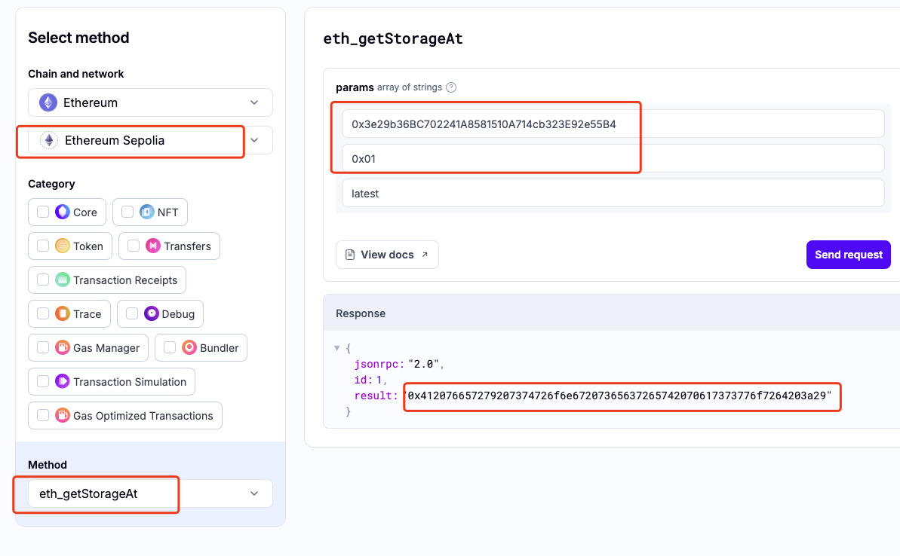

# level8 vault

# 1. 问题

要求你将合约`Vault`中的`locked`字段设置为false。

```solidity
// SPDX-License-Identifier: MIT
pragma solidity ^0.8.0;

contract Vault {
    bool public locked;
    bytes32 private password;

    constructor(bytes32 _password) {
        locked = true;
        password = _password;
    }

    function unlock(bytes32 _password) public {
        if (password == _password) {
            locked = false;
        }
    }
}
```

# 2. 解法

这个题目是想告诉你, 在solidity中，不存在真正的`private`的字段。private的变量，并不是真的看不到，只是说其他合约无法直接读取，但是区块链数据是公开的，大家还是有别的办法看到的
> 类比一下，就好像你看没办法通过sql命令，看到mysql服务在服务器上安装的路径，但是你可以登录服务器看看到底安装在哪里了

1. 我们使用第三方的合约storage读取工具查看这个`Vault`合约中password的变量值。这里我们使用使用alchemy提供的[https://composer.alchemy.com/](https://composer.alchemy.com/) 服务

    * 选择sepolia，RPC选择 `eth_getStorageAt`
    * 第一个参数填合约地址 `0x3e29b36BC702241A8581510A714cb323E92e55B4`
    * 第二个参数选择slot的index，我们选择`0x01`（第二个）

2. 查询得到结果 `0x412076657279207374726f6e67207365637265742070617373776f7264203a29`



3. 合约代码复制到remix里面，编译，然后选择`at address`，创建一个实例

4. 调用一下`unlock`，并且把上面的结果作为参数传入，发起交易 [0x487324a8efeaa57c5e44fd1ff538ed3382b09da71412b5d8ce4c2ef3d7268ebe](https://sepolia.etherscan.io/tx/0x487324a8efeaa57c5e44fd1ff538ed3382b09da71412b5d8ce4c2ef3d7268ebe)

5. 点击`locked`，发现返回false了

6. 提交交易 [0xea1111d1fae932c6262a3cb5e82f243cf92e9cd0733cdc00df4556155b188d19](https://sepolia.etherscan.io/tx/0xea1111d1fae932c6262a3cb5e82f243cf92e9cd0733cdc00df4556155b188d19)，成功！