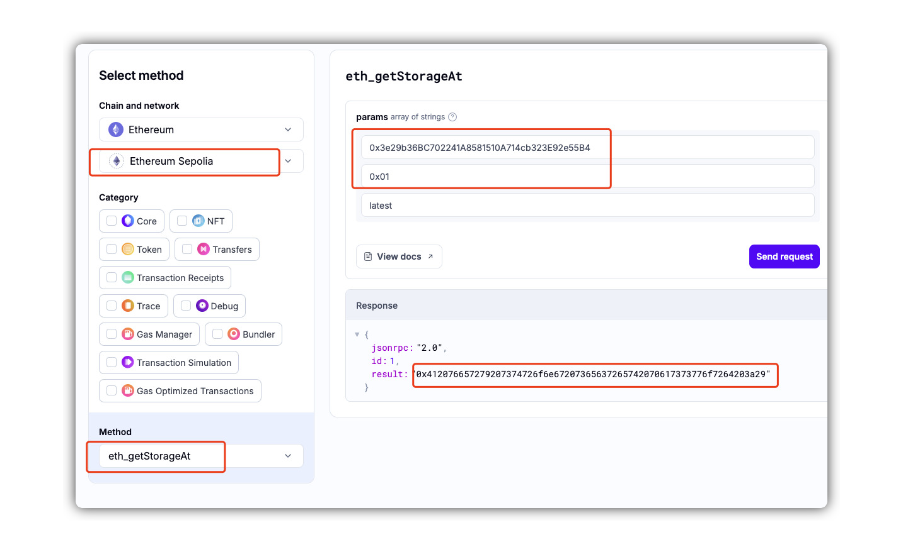

# level8 Vault

## 1. 问题

要求将 `Vault` 合约中的 `locked` 字段设置为 `false`。

```solidity
// SPDX-License-Identifier: MIT
pragma solidity ^0.8.0;

contract Vault {
    bool public locked;
    bytes32 private password;

    constructor(bytes32 _password) {
        locked = true;
        password = _password;
    }

    function unlock(bytes32 _password) public {
        if (password == _password) {
            locked = false;
        }
    }
}
```

## 2. 解法

这个题目想要说明，在 Solidity 中**不存在**真正意义上的 `private` 字段。

`private` 变量并不是真的不可见，只是无法通过其他合约直接访问。但由于区块链上的数据是公开的，因此仍可以通过其他方式读取这些数据。

> 类比一下，这就好比你无法通过 SQL 命令直接查看 MySQL 服务的安装路径，但仍然可以登录服务器查看其具体安装位置。

1. 使用第三方合约存储读取工具查看 `Vault` 合约中 `password` 变量的值。这里使用 Alchemy 提供的服务：[Alchemy Composer](https://composer.alchemy.com/)。

    * 选择网络为 Sepolia，RPC 方法选择 `eth_getStorageAt`。
    * 第一个参数填写合约地址：`0x3e29b36BC702241A8581510A714cb323E92e55B4`。
    * 第二个参数填写存储槽索引：`0x01`（对应第二个槽）。

2. 查询结果为：`0x412076657279207374726f6e67207365637265742070617373776f7264203a29`。



3. 合约代码复制到remix里面，编译，然后选择`at address`，创建一个实例

4. 调用 `unlock` 方法，将上述结果作为参数传入并发起交易：[交易链接](https://sepolia.etherscan.io/tx/0x487324a8efeaa57c5e44fd1ff538ed3382b09da71412b5d8ce4c2ef3d7268ebe)。

5. 调用 `locked` 方法，确认返回值为 `false`。

6. 点击 `submit instance`， 提交通过！


<br/>
<br/>
| [⬅️ level7 Force](../level7_force/README.md) | [level9 King ➡️](../level9_king/README.md) |
|:------------------------------|--------------------------:|